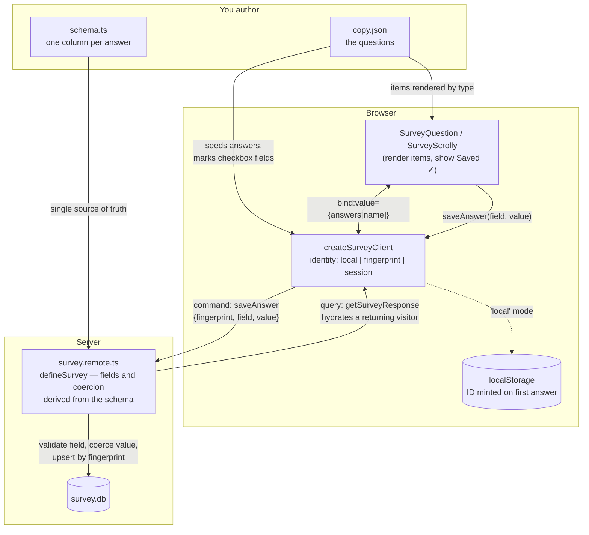

# Survey stories

Build a survey as a story: questions live in `copy.json` like any other story
content, answers land in a story-local SQLite file, keyed by an anonymous
browser fingerprint and saved field-by-field as the reader interacts.

You author **two things** — a Drizzle table and your questions. Two small glue
files wire them together:



The reader's side is one loop: a question component binds an answer and calls
`saveAnswer` on interaction; the client owns the visitor ID and talks to the
two remote functions; the server derives everything else from your schema.

## New survey story in four files

**1. `data/schema.ts` — one column per answer** (plus the three reserved
columns `id`, `fingerprint`, `createdAt`):

```ts
import { integer, sqliteTable, text } from 'drizzle-orm/sqlite-core';
import { sql } from 'drizzle-orm';

export const mySurvey = sqliteTable('my_survey', {
	id: integer('id').primaryKey({ autoIncrement: true }),
	fingerprint: text('fingerprint').notNull().unique(),
	favoriteColor: text('favorite_color'),
	rating: integer('rating'), // integer column → string answers auto-parseInt'd
	createdAt: text('created_at').default(sql`(CURRENT_TIMESTAMP)`)
});
```

**2. `data/copy.json` — the questions.** `type` is one of
`radio | checkbox | select | text`; `name` must match a schema column.
Checkbox answers are arrays (stored comma-joined). Prose items
(`markdown`, …) can be mixed in between questions.

```json
"survey": [
	{ "type": "radio", "value": { "question": "…", "name": "favoriteColor",
		"options": [ { "value": "teal", "label": "Teal" } ] } },
	{ "type": "text",  "value": { "question": "Why?", "name": "reason" } }
]
```

**3. `data/survey.remote.ts` — the whole server side:**

```ts
import { defineSurvey } from '$lib/server/survey';
import { mySurvey } from './schema';

const survey = defineSurvey({
	table: mySurvey,
	dbPath: 'src/lib/stories/my-story/data/survey.db'
});

export const saveAnswer = survey.saveAnswer;
export const getSurveyResponse = survey.getSurveyResponse;
```

Valid fields and number coercion are derived from the table — the schema is
the single source of truth. Options: `envKey` names a per-story env var that
overrides `dbPath` on deploys; `coerce` overrides storage per field for
semantic rules (e.g. `coerce: { consent: () => 1 }`).

**4. `components/Index.svelte` — layout:**

```svelte
<script lang="ts">
	import { SurveyQuestion, createSurveyClient } from '$lib/components/survey';
	import * as remote from '../data/survey.remote.js';

	let { data } = $props();
	const survey = createSurveyClient(remote, { questions: data.survey });
</script>

{#each data.survey as item (item.value.name)}
	<SurveyQuestion {item} bind:value={survey.answers[item.value.name]} saveAnswer={survey.saveAnswer} />
{/each}
```

There is nothing to initialize: the client starts itself in the browser,
`saveAnswer` waits for that startup, and a returning visitor sees their saved
answers. `survey.response` is the stored row (`null` until loaded, see
`survey.loading`) — useful for consent gates.

## Visitor identity

Answers are keyed by an opaque visitor ID (the `fingerprint` column). How that
ID comes to exist is the story's privacy posture — `identity` option:

- **`'local'` (default)** — a random ID minted on the visitor's *first answer*
  and kept in localStorage. Nothing is probed or stored before they
  participate, the ID means nothing outside this survey, and clearing site
  data forgets them. Right for anonymous polls; dedup is browser-deep only.
- **`'fingerprint'`** — a device fingerprint computed on load: strong dedup
  and returning-visitor recognition that survives storage clears. Reads device
  characteristics, so reserve it for consent-gated studies (and note that for
  EU-facing participants it requires prior consent — ePrivacy Art. 5(3)).
- **`'session'`** — in-memory only: correlates one visit's answers, stores
  nothing on the device, every reload is a fresh respondent.

Then create the DB and register the story:

```bash
STORY=my-story npm run db:push:story   # creates/updates data/survey.db from schema.ts
# add a row to src/lib/data/stories.csv
```

(One shared `drizzle.story.config.ts` serves every story DB by convention —
no per-story config file.)

## Building blocks

- `SurveyQuestion` — renders any question item (dispatches on `type`)
- `SurveyScrolly` — questions as scrolly steps: `<SurveyScrolly items={data.survey} answers={survey.answers} saveAnswer={survey.saveAnswer} />`
- `ConsentPopup` — consent gate; body text via children, `onAccept` decides what consent means
- `createSaver` / `SaveFeedback` — the "Saving… / Saved ✓" machinery, for custom question UIs (see survey-story-1's `DemographicsBox`)

## Theming

Question components read `--vcsi-survey-*` tokens (falling back to the global
`--vcsi-*` tokens): `-fg`, `-muted`, `-border`, `-control-bg`,
`-control-bg-muted`, `-accent`, `-accent-hover`. Override them on a scope —
e.g. a dark story with light scrolly step boxes pins them per-section
(see survey-story-1's `#survey` block).
